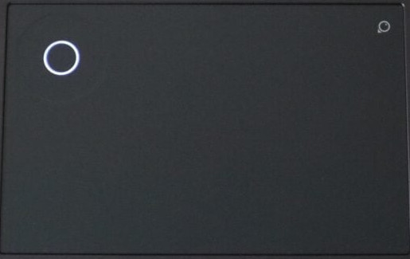

# Asus touchpad DialPad driver

[](https://www.gnu.org/licenses/old-licenses/gpl-2.0.en.html)

[](https://github.com/asus-linux-drivers/asus-dialpad-driver/releases)
[](https://GitHub.com/asus-linux-drivers/asus-dialpad-driver/commit/)
[](https://GitHub.com/asus-linux-drivers/asus-dialpad-driver/issues?q=is%3Aissue+is%3Aclosed)
[](https://github.com/asus-linux-drivers/asus-dialpad-driver/compare)
[](https://github.com/asus-linux-drivers/asus-dialpad-driver/issues/new/choose)
[](http://makeapullrequest.com)

--
[](https://github.com/asus-linux-drivers/asus-dialpad-driver#installation)


The driver is written in python and does not necessarily run as a systemd service ([How to start DialPad without systemd service?](#faq)). It contains the common DialPad layouts, you can pick up the right one during the install process. Default settings aim to be the most convenient for the majority. All possible customizations can be found [here](#configuration).

If you find this project useful, please do not forget to give it a [](https://github.com/asus-linux-drivers/asus-dialpad-driver/stargazers) People already did!

[](https://ko-fi.com/ldrahnik)

## Changelog

[CHANGELOG.md](CHANGELOG.md)

## Frequently Asked Questions

[FAQ](#faq)

## Features of User Interface

- Support for own icons in `.svg` format
- Double-clicking by left mouse button unlocks / locks the element position allowing it to be moved across the screen

## Features

- Driver during installation collects anonymous data with goal improve driver (e.g. automatic layout detection or [for kernel driver development](https://lookerstudio.google.com/u/0/reporting/a9ed8ed9-a0d7-42bd-96e9-57daed8697b1/page/p_e0hnu8md0d); data are publicly available [here](https://lookerstudio.google.com/s/gaK2TftgZqM), you can provide used config using `$ bash install_config_send_anonymous_report.sh`)
- Driver (including backlighting if hardware supported) installed for the current user
- Driver creates own virtual environment of currently installed version of `Python3`
- Multiple pre-created [DialPad layouts](https://github.com/asus-linux-drivers/asus-dialpad-driver#layouts) with the possibility of [creating custom layouts or improving existing ones (circle_diameter, center_button_diameter, circle_center_x..)](https://github.com/asus-linux-drivers/asus-dialpad-driver#keyboard-layout)
- Optional [Layout Manager](#layout-manager-and-json-presets) for structured shortcut editing, hardware geometry, import/export, and revision-confirmed layout switching without editing service units
- JSON presets and statically readable Python layouts, with gesture-safe hot reload and validated last-successful recovery
- Customization through 2-way sync [configuration file](https://github.com/asus-linux-drivers/asus-dialpad-driver#configuration-file) (when `$ bash ./install.sh` is run, changes previously made in the config file will not be overwritten without user permission, similarly when `$ bash ./uninstall.sh` is run the config file will be kept. In either case, when the config file or parts of it do not exist they will be automatically created or completed with default values)
- Automatic DialPad layout detection
- Activation/deactivation of DialPad by pressing and holding the top-right icon (activation time by default is 1s)
- Optional co-activator key requirement (`Shift`, `Control`, `Alt`) to prevent accidental DialPad activation
- Recognize of currently focused app by binary path (e.g. `/usr/share/code/code`) or part of the title (during finding the first matched shortcut wins so `visual studio code` defined after `code` will be never be matched)
- Per-application single-function or multifunction mappings; unmatched applications use the required `none` mapping, while an explicitly empty matched mapping stays empty
- Single-function mode (distinction of shortcuts for each app is possible only by key modifier like `Shift`; for each shortcut is possible to use `clockwise`, `counterclockwise` or `center`)
- Adding events with `EV_KEY` which contain press and release events (e.g. key volume up, down and mute: `EV_KEY.KEY_VOLUMEUP, EV_KEY.KEY_VOLUMEDOWN, EV_KEY.KEY_MUTE`)

```
...
app_shortcuts = {
    ...
    "none": {
        "center": [
          {"key": EV_KEY.KEY_MUTE, "trigger": "release", "duration": 1, "modifier": EV_KEY.KEY_LEFTSHIFT}
        ],
        "clockwise": [
          {"key": [EV_REL.REL_WHEEL, EV_REL.REL_WHEEL_HI_RES], "value": [1, 120], "trigger": "immediate", "title": "Scroll"},
          # works even better with `dconf write /org/gnome/desktop/sound/allow-volume-above-100-percent true`
          {"key": EV_KEY.KEY_VOLUMEUP, "trigger": "immediate", "modifier": EV_KEY.KEY_LEFTSHIFT, "value": "pactl get-sink-volume @DEFAULT_SINK@ | grep -oP '\d+%' | head -n 1 | tr -d '%'", "unit": "%", "title": "Volume"}
        ],
        "counterclockwise": [
          {"key": [EV_REL.REL_WHEEL, EV_REL.REL_WHEEL_HI_RES], "value": [-1, -120], "trigger": "immediate", "title": "Scroll"},
          # works even better with `dconf write /org/gnome/desktop/sound/allow-volume-above-100-percent true`
          {"key": EV_KEY.KEY_VOLUMEDOWN, "trigger": "immediate", "modifier": EV_KEY.KEY_LEFTSHIFT, "value": "pactl get-sink-volume @DEFAULT_SINK@ | grep -oP '\d+%' | head -n 1 | tr -d '%'", "unit": "%", "title": "Volume"}
        ]
    }
}
```

- Multi-function mode uses the center control to confirm/leave a selected function. The ring is padded to `slices_minimum_count` (default: 4).
- Using `EV_REL` with values (e.g. scrolling: `EV_REL.REL_WHEEL, EV_REL.REL_WHEEL_HI_RES` and values: `-1, -120`)

```
        "Scroll": {
            "icon": "/usr/share/icons/elementary/status/symbolic/rotation-allowed-symbolic.svg",
            "clockwise": [
               {"key": [EV_REL.REL_WHEEL, EV_REL.REL_WHEEL_HI_RES], "value": [1, 120], "trigger": "immediate"},
            ],
            "counterclockwise": [
              {"key": [EV_REL.REL_WHEEL, EV_REL.REL_WHEEL_HI_RES], "value": [-1, -120], "trigger": "immediate"},
            ]
        },
```
- Using `command` for toggling instead of sending any key
- Have icon displayed according to current state determined by `value` command

```
        "Notifications": {
          "value": "dconf read /io/elementary/notifications/do-not-disturb",
          "icons": {
              "true": "/usr/share/icons/elementary/status/symbolic/notification-disabled-symbolic.svg",
              "false": "/usr/share/icons/elementary/status/symbolic/notification-symbolic.svg"
          },
          # toggle do-not-disturb ("command" with toggle effect is preferred if exists over going into and clockwise/counterclockwise)
          "command": 'dconf write /io/elementary/notifications/do-not-disturb "$( [ "$(dconf read /io/elementary/notifications/do-not-disturb)" = "true" ] && echo false || echo true )"',
        },
```

- Possibility to trigger both types `EV_REL` and `EV_KEY` on `release` or `immediately`
- Using for a less continous function with increasing `treshold` (e.g. editing changes undo and redo)

```
        "Edit": {
            "icon": "/usr/share/icons/elementary/status/symbolic/media-playlist-repeat-symbolic-rtl.svg",
            "treshold": 180,
            "clockwise": [
              {"key": [EV_KEY.KEY_LEFTCTRL, EV_KEY.KEY_Y], "trigger": "immediate"}
            ],
            "counterclockwise": [
              {"key": [EV_KEY.KEY_LEFTCTRL, EV_KEY.KEY_Z], "trigger": "immediate"}
            ]
        },
```

- Possibility to temporary force using not app specific shortcut without removing app specific shortcuts from layout (`config_supress_app_specifics_shortcuts`)
- Disabling the Touchpad (e.g. Fn+special key) disables by default the DialPad as well (can be disabled)

## Installation

Get the latest stable or dev version using `git`:

```bash
$ git clone https://github.com/asus-linux-drivers/asus-dialpad-driver
$ cd asus-dialpad-driver
# now you are using master branch with the latest changes which may be not stable
# jump to the latest release of stable version:
$ git checkout v2.5.2
```

or customized install:

```
# ENV VARS (with the defaults)
INSTALL_DIR_PATH="/usr/share/asus-dialpad-driver"
LOGS_DIR_PATH="/var/log/asus-dialpad-driver" # only for install and uninstall logs
INSTALL_UDEV_DIR_PATH="/usr/lib/udev"
```

### Installation on Immutable Systems (BazziteOS, Fedora Silverblue, Kinoite)

For immutable Linux distributions, use custom paths and expect two reboots:

```bash
# First run - installs system packages
$ INSTALL_DIR_PATH="/home/$USER/.local/share/asus-dialpad-driver" \
  INSTALL_UDEV_DIR_PATH="/etc/udev" \
  bash install.sh

# Reboot when prompted (required for package layering)
$ systemctl reboot

# Second run - completes driver installation
$ INSTALL_DIR_PATH="/home/$USER/.local/share/asus-dialpad-driver" \
  INSTALL_UDEV_DIR_PATH="/etc/udev" \
  bash install.sh

# Final reboot (required for group membership)
$ systemctl reboot
```

**Why two reboots?** Immutable systems require a reboot after layering packages and another after group membership changes.

---

or run separately parts of the install script.

Try found Touchpad with DialPad:

```bash
$ bash install_device_check.sh
```

Add a user to the groups `i2c,input,uinput`:

```bash
$ bash install_user_groups.sh
```

Run driver now and every time that user logs in (do NOT run as `$ sudo`, works via `systemctl --user`):

```bash
# with user interface
$ bash install_user_interface.sh
$ bash install_service.sh

# with no user interface
$ USER_INTERFACE=0 \
 bash install_service.sh
```

#### NixOS

Nix code is provided for this driver.
Please read the `nix/module.nix` for default behavior.

<details>
<summary>The driver installation (NixOS)</summary>
<br>

##### All Nix versions

First, you will want to pin this repository using your input pinner of choice (some [listed on the Wiki](https://wiki.nixos.org/wiki/Applications#Dependencies)).
After, we need to add the overlay & module to the system.
While there are many ways to organize a NixOS system, for a simple `configuration.nix`-only example:

```nix
# configuration.nix
{ config, lib, pkgs, ... }:

let
  inputs = import ./my/pinned/inputs { };
in
{
  system = "x86_64-linux";

  nixpkgs.overlays = [
    (import "${inputs.asus-dialpad-driver}/nix/overlay")
  ];

  modules = [
    (import "${inputs.asus-dialpad-driver}/nix/module.nix")
  ];

  # Users *must* be enrolled in these groups
  users.users.alice = {
    extraGroups = [ "i2c" "input" "uinput" ];
  };

  # Enable Asus DialPad Service
  hardware.asus-dialpad-driver = {
    enable = true;
    sessionTypes = [ "wayland" "x11" ]; # default
    # Enable user-level systemd service
    daemon.enable = true; # default
    layout = "proartp16"; # default
    layoutManager.enable = true; # optional; false by default, independent of overlay
    defaultConfig = { /* … */ };
    # Overwrite any default env var
    environment = {
      LOG = "DEBUG";
      XDG_SESSION_TYPE = "wayland";
    };
  };
}
```

> The key for the caclulator toggling script should be associated with XF86Calculator, allowing it to toggle any calculator application, not just the one specified in the configuration. This means that the key binding can be used to manage various calculator applications across different key binding configurations. For e.g.:

```nix
"XF86Calculator".action = sh -c "if pidof gnome-calculator > /dev/null; then kill $(pidof gnome-calculator); else gnome-calculator; fi";
```

##### Nix flakes only

[Flakes](https://nix.dev/concepts/flakes.html) are another, experimental way to add asus-dialpad-driver to your system.
To add it to your system’s flake.

```nix
# flake.nix

{

    inputs = {
        # ---Snip---
        asus-dialpad-driver = {
          url = "github:asus-linux-drivers/asus-dialpad-driver/v2.5.2"; # use this line for the latest release of stable version
          # url = "github:asus-linux-drivers/asus-dialpad-driver"; # or this line for using master branch with the latest changes which may be not stable
          inputs.nixpkgs.follows = "nixpkgs";
        };
        # ---Snip---
    }

    outputs = {nixpkgs, asus-dialpad-driver, ...} @ inputs: {
        nixosConfigurations.HOSTNAME = nixpkgs.lib.nixosSystem {

            modules = [
                ({ ... }: {
                  nixpkgs.overlays = [
                    asus-dialpad-driver.overlays.default
                  ];
                })
                asus-dialpad-driver.nixosModules.default
                ./configuration.nix
            ];
        };
    }
}
```
Then you can enable the service, `services.asus-dialpad-driver`, in your `configuration.nix` file in the same way as the prior section for stable Nix.

</details>

## Uninstallation

Configuration, user layouts, bundled-layout customizations, and `.layout-state/` recovery data are preserved by default, including when configuration and installation share a directory. The installer records a custom configuration directory in `.installation.json`; reinstall/uninstall reads that path unless explicitly overridden. Removing program files also removes unchanged recorded CLI/manager launchers and desktop entries. Modified launchers are retained.

The uninstaller offers an explicit `PURGE` confirmation for deleting the selected configuration/layout/recovery data. Back up custom layouts first. It does not delete an entire configuration directory that may contain unrelated files. If a partial installation has lost `dialpad.py`, it still removes exactly named DialPad service templates, udev rules, and module-load files that remain; an editor-only installation does not trigger service or privileged cleanup.

To uninstall run

```bash
$ bash uninstall.sh

# ENV VARS (with the defaults)
INSTALL_DIR_PATH="/usr/share/asus-dialpad-driver"
CONFIG_FILE_DIR_PATH="$INSTALL_DIR_PATH"
CONFIG_FILE_NAME="dialpad_dev"
LOGS_DIR_PATH="/var/log/asus-dialpad-driver" # only for install and uninstall logs
SERVICE_INSTALL_DIR_PATH="$HOME/.config/systemd/user"
INSTALL_UDEV_DIR_PATH="/usr/lib/udev"
MODULES_LOAD_DIR_PATH="/etc/modules-load.d"

# e.g. for BazziteOS (https://github.com/asus-linux-drivers/asus-numberpad-driver/issues/198)
$ INSTALL_DIR_PATH="/home/$USER/.local/share/asus-dialpad-driver"\
INSTALL_UDEV_DIR_PATH="/etc/udev/"\
bash uninstall.sh
```

or run separately parts of the uninstall script

```bash
$ bash uninstall_service.sh
$ bash uninstall_user_groups.sh
```

## Layout Manager and JSON presets

Requires Python 3.10+. The independent editor uses the optional `requirements.ui.txt` dependency group (PySide6); the driver and portable layout library do not import Qt.

### Install and launch

The ordinary installer offers the manager and floating overlay separately. To install just the editor, without provisioning input devices or enabling either service:

```bash
INSTALL_DIR_PATH="$HOME/.local/share/asus-dialpad-driver" \
CONFIG_FILE_DIR_PATH="$HOME/.config/asus-dialpad-driver" \
bash install_layout_manager.sh

"$HOME/.local/bin/asus-dialpad-layout-manager"
```

Run installer scripts from this checkout as a normal user, not with `sudo bash`. The standalone manager installer needs Python venv support; it installs the shared model, catalogs, layouts, Qt dependencies, and both editor modules. The desktop entry starts the same launcher. `DIALPAD_BIN_DIR_PATH` and `DIALPAD_APPLICATIONS_DIR_PATH` override launcher/desktop destinations.

For an existing driver, use **its actual configuration directory**, including a custom `CONFIG_FILE_DIR_PATH`. Ordinary installation defaults to `/usr/share/asus-dialpad-driver`; Nix uses the user's XDG config directory under `asus-dialpad-driver`. Multiple directories represent separate driver instances, not interchangeable fallback locations.

From a checkout:

```bash
python3 dialpad_layout_manager.py --config-dir /absolute/config/directory
# No Linux adapter or live endpoint is used:
python3 dialpad_layout_manager.py --config-dir /absolute/config/directory --offline
```

Source CLI/GUI entry points require `--config-dir` or `DIALPAD_CONFIG_DIR`; they never guess among existing directories. Installed ordinary launchers embed the selected directory and accept an explicit `--config-dir` override. Nix launchers use `DIALPAD_CONFIG_DIR`, otherwise `${XDG_CONFIG_HOME:-$HOME/.config}/asus-dialpad-driver`.

On NixOS, set `hardware.asus-dialpad-driver.layoutManager.enable = true`; this can also be enabled without the hardware/daemon for offline editing. The derivation exposes `layoutManagerSupport`, defaulting to `false`. Headless packages have no PySide6 dependency. The floating overlay remains a separate optional application.

### Editing workflow

1. Select a hardware template and **Copy** a bundled preset to a distinct user identifier. Built-ins are read-only in the editor, even if their directory is writable.
2. Edit ordered application rules, direct/shared controls, and named functions. Switching single/multifunction editor views preserves both sets of bindings. The key picker supports searching event names, modifier conditions, timing, commands, labels, icons, value queries, and thresholds.
3. Geometry uses **absolute touchpad coordinates, not screen pixels**. Numeric controls and canvas handles move/resize the circle, center button, and activation region. Without driver-reported extents the canvas is explicitly schematic, not calibrated. Ordinary shortcut editing does not require geometry changes.
4. **Preview tool ring** opens the static preview, using the same 275-by-275 logical-pixel renderer as the floating overlay. It follows function order clockwise from the top, including `slices_minimum_count` padding, without running commands.
5. **Validate** and **Save** the document. Save does not change the selected identifier. Saving a file already in use requests a reload and is labeled/warned accordingly.
6. **Activate saved revision** requests selection, then displays the actual driver's acknowledgment. Unsaved draft, saved revision, requested revision, and applied revision are distinct states. Closing the manager leaves the driver running.

Named functions are the floating overlay's tool-ring entries, not a separate collection to configure. In **Multifunction / named functions**, use **Add function**, **Up/Down**, and **Command / display metadata…** to edit their order, labels, icons, units, and value queries. The bundled `proartp16` preset's `none` fallback uses direct controls; its named-function example is attached to `/usr/share/code/code`. To make a ring available outside that application, edit the appropriate application rule in a user copy.

The preview resolves each function's base `icon` as a local file or an icon-theme name. Missing or unreadable icons fall back to the display title; long labels wrap to two lines and use an ellipsis for overflow. Hovering the canvas exposes the full tool labels. Live feedback highlights the selected function by its stored index, not its display title, so empty or repeated titles do not change the highlighted sector. The static preview has no selected function. The preview uses a neutral background, whereas the live overlay retains desktop transparency, so compositor effects and background contrast can differ.

Previewing never binds the feedback socket, executes commands/value queries, or evaluates conditional icon queries. It shows base icons rather than guessing a query result, and does not simulate live numeric values or gesture progress. Overlay window size and colors are not touchpad geometry settings and are not edited by the geometry canvas.

Raw JSON is a separate editable draft. **Apply JSON to forms** validates before replacing structured data; invalid text remains intact. Navigation offers Save/Discard/Cancel. External file changes are not silently overwritten: reload the external file or save a new copy. Import/export preserve ordering and do not execute Python or shell commands.

Rename/deletion retains the original until the same driver instance acknowledges the exact replacement revision. Concurrent activation/removal uses the configuration sidecar transaction. Without live status these destructive operations refuse safely; copying and exporting remain available. Canceling a pending removal retains the original but does not undo an already persisted replacement request.

### Built-in help and interface language

Use **Help (F1)** to open the searchable offline help center. Nearby **?** buttons explain the associated field or group of actions; **F1** opens the topic for the focused control, including inside shortcut/metadata dialogs. Help remains available when editing is disabled. It covers application precedence, named-function tools, event/modifier/trigger semantics, geometry, raw JSON, revision/activation state, and execution/trust boundaries. Opening help never contacts the driver, runs a command, or opens an external website.

The manager supports **English**, **Simplified Chinese**, and **Traditional Chinese**, including the help content. **System default** selects Chinese according to the system language/region/script and otherwise falls back to English. Use the **Interface language** selector to override it. Changes take effect on the **next manager start**; the open window and any unsaved or invalid raw draft remain intact.

The preference is stored separately with Qt `QSettings` (`IniFormat`, organization `asus-dialpad-driver`, application `layout-manager`, key `ui/language`). On Linux this normally resolves to `${XDG_CONFIG_HOME:-$HOME/.config}/asus-dialpad-driver/layout-manager.ini`. It is not written into `dialpad_dev` or a layout, and driver uninstallation does not remove this per-user UI preference.

Interface translation does not change identifiers, application rules, user-authored titles, commands, event names, file paths, protocol values such as `release`/`immediate`, or raw backend error details. The CLI and log diagnostics retain their original text.

Translation resources are three independent UTF-8 files: `locales/en_US.json`, `locales/zh_CN.json`, and `locales/zh_TW.json`. The language identifier used by the selector and by the per-user preference is the catalog file name without `.json`, so `en_US` is chosen and stored rather than a bare `en`. Each file is a nested JSON object with `common`, `help`, `editor`, and `manager` namespaces. Code looks up a stable semantic path, for example `tr("manager.actions.save")`; English display text is never a lookup key. Each path segment matches `[a-z][a-z0-9_]*`, with dots separating levels and no spaces:

```json
{
  "manager": {
    "actions": {
      "save": "Save"
    }
  }
}
```

The same nested path appears in all three language files. Changing English wording does not rename its key. Translations must retain named `{placeholders}` with the same format specifications and conversions; user values are formatted once after lookup. Missing or incompatible translated entries fall back to the English file, and catalog load failures are logged. English is a required resource; invalid lookup syntax and paths missing from English raise errors rather than displaying message IDs or treating them as English text. No source-text compatibility lookup remains. A per-user preference still stored as the earlier bare `en` keeps selecting English; the next language selection writes the standard identifier.

No catalog compilation tool or additional dependency is required. Ordinary manager installation and the optional Nix manager package include all three files; upgrading retires only the old manager-owned section catalogs and the pre-rename `en.json`. Uninstallation preserves unrelated files under `locales/`. The headless driver and floating overlay do not import the help or i18n modules.

Unverified hardware/platform behavior is tracked separately in the [outstanding verification checklist](docs/issue-31-layout-manager-plan.md#outstanding-verification-checklist). Built-in help describes behavior but does not replace those acceptance checks.

### Files, identity, and selection

The driver searches `<config_dir>/layouts/` before `<driver_install_dir>/layouts/`, deduplicating equivalent directories. Within each directory, `<id>.json` wins over `<id>.py`; directory priority comes first. An invalid higher-priority file is an error, not permission to load a lower-priority file silently.

Identifiers match `[A-Za-z0-9][A-Za-z0-9_-]*`. The optional JSON `name` is only a display label and never a file path. The installed `bundled-layouts.json` manifest identifies protected built-in files independently of directory permissions, including configurations that share the install directory. User copies use distinct identifiers by default.

Selection precedence:

1. Nonempty `[main] layout` in `<config_dir>/dialpad_dev`.
2. The driver's existing first positional layout argument.
3. A clear error if neither exists and no valid last-successful recovery is available.

The argv fallback is **not persisted** as an explicit selection. Nix `cfg.layout` therefore remains effective unless an explicit user selection overrides it. Clear `layout` to return to that default. Reinstallation preserves an existing explicit selection; selecting a new layout deliberately patches just `layout`.

All cooperating configuration writers use a stable `.dialpad_dev.lock`, read the latest file under the lock, merge only changed keys/missing defaults, and atomically replace the INI file. Unrelated keys and sections survive simultaneous `layout` and `enabled` changes. Malformed configuration is reported, not replaced with defaults.

### JSON schema and compatibility

Version 1 contains `schema_version`, `geometry`, `app_shortcuts`, and optional `name`:

```json
{
  "schema_version": 1,
  "name": "My ProArt",
  "geometry": {
    "top_right_icon_width": 250,
    "top_right_icon_height": 250,
    "circle_diameter": 919,
    "center_button_diameter": 364,
    "circle_center_x": 586,
    "circle_center_y": 573
  },
  "app_shortcuts": {
    "firefox": {},
    "none": {
      "center": [{"key": "KEY_MUTE", "trigger": "release", "duration": 0.5}],
      "clockwise": [{
        "key": ["REL_WHEEL", "REL_WHEEL_HI_RES"],
        "value": [1, 120], "trigger": "immediate", "title": "Scroll"
      }],
      "counterclockwise": [{
        "key": ["REL_WHEEL", "REL_WHEEL_HI_RES"],
        "value": [-1, -120], "trigger": "immediate", "title": "Scroll"
      }]
    }
  }
}
```

- `center`, `clockwise`, and `counterclockwise` contain an action object or ordered action list. Other profile keys name functions; a function can contain rotation/center actions, metadata, or only a `command`.
- `key` is an event-name string or ordered combination. `KEY_`/`BTN_` keys produce a complete press/release sequence; `REL_` events require a corresponding array of signed 32-bit integer `value`s. Mixing key and relative events in one action is rejected.
- A string `value` is a shell display-value query, not an event value. It is supported on key/command/control metadata and functions, but cannot replace a relative event's numeric values. The runtime separates these meanings during compilation.
- `command` runs a shell action and can accompany keys. A trigger/duration-only center entry is a valid selection control. Command-only functions need no invented rotation bindings.
- `trigger` is `release` (default) or `immediate`; `duration` is a nonnegative hold duration in seconds. `modifier` is a single key/button event condition. Modifier-specific alternatives take precedence, preserving their original relative order; unmodified alternatives match when no configured shortcut modifier is held.
- `title`, `icon`, `icons` (query-result-to-icon mapping), `unit`, and historical `treshold` provide metadata. A display title is not a selected function identifier; labels such as `Scroll` do not require a function with that name.
- Application matching preserves the existing ordered, case-sensitive rule keys against lowercased binary/title strings: the first binary substring match wins, then the first title substring match, then `none`. The reserved `none` rule never participates in substring matching. Use lowercase rule keys. An explicitly empty matched rule disables its bindings rather than falling back.
- Rule, function, and action order is preserved by serialization. Unknown fields, duplicate JSON keys, unsupported schema versions, non-finite geometry, invalid event/value combinations, and missing `none` are errors with field paths. Missing device information does not block offline validation.

The portable picker uses `dialpad_events.json`, generated from Linux UAPI `input-event-codes.h` without loading a native library:

```bash
python3 tools/generate_event_catalog.py /usr/include/linux/input-event-codes.h
```

The catalog records its source hash. The Linux adapter additionally resolves every event against the installed `libevdev`; a newer catalog cannot make an older runtime support an unavailable event.

### CLI and trust boundaries

```bash
python3 dialpad_layout.py --config-dir /absolute/config list --json
python3 dialpad_layout.py --config-dir /absolute/config validate proartp16
python3 dialpad_layout.py --config-dir /absolute/config convert proartp16 /absolute/config/layouts/my_proart.json
python3 dialpad_layout.py --config-dir /absolute/config export my_proart /tmp/my_proart.json
python3 dialpad_layout.py --config-dir /absolute/config activate my_proart
python3 dialpad_layout.py --config-dir /absolute/config status
# Installed launcher already supplies its configured directory:
asus-dialpad-layout config-set enabled 1
```

`activate` writes a request; its output is not an acknowledgment. `status` reports the live instance. Listing, static validation, conversion, JSON editing, and previews use only portable data and never execute a layout or its shell commands.

The shipped Python layouts use the supported literal-assignment/known-event AST subset. Unsupported dynamic files are left unchanged, not guessed or silently converted. For an explicitly trusted external Python file, use the CLI's `--trusted-python` conversion option (see `convert --help`); the manager offers explicit trusted conversion for installed Python files. Trusted execution uses the exact source bytes used for the revision, not a timestamp-cached `.pyc`.

Dynamic Python in the driver itself requires appending `--trusted-python` after its positional layout and configuration-directory arguments. It executes as your user. Imported helper modules are not automatically reloaded, and failed candidates cannot undo Python or shell side effects. Character/keysym bindings that cannot be converted losslessly fail explicitly; retain the original Python source. The GUI's command-trust confirmation does not authorize dynamic Python execution in the driver.

The editor can edit/export JSON without `libevdev`, `fcntl`, pyinotify, a running driver, or Linux session integration. Activation is disabled offline/on non-Linux platforms. Linux command strings and icon paths are not made portable by using Qt; Windows/macOS execution still requires separate platform verification.

### Keyboard selection and session keymaps

Modifier conditions use one typing-capable input keyboard selected at driver startup. Selection checks the kernel's key capabilities rather than requiring an ASUS product-name match. Previously recognized AT/ASUS keyboards retain priority; otherwise the first qualifying device is used. Uinput devices under `/devices/virtual/input/` are excluded so virtual output is not fed back as physical modifier input. Bluetooth HID keyboards remain eligible.

GNOME input-source polling runs only for a matching desktop session, not merely because `gsettings` is installed. The parser accepts typed empty GVariant lists and does not pass input-method engine identifiers to `setxkbmap`. Native Wayland/X11 keymap listeners remain independent of this GNOME-specific polling.

### Hot reload, status, and recovery

The input owner commits a prepared snapshot only at a complete input-frame boundary after every contact/MT slot has ended and the old gesture's release actions have completed. Window/keymap updates follow the same ownership rule. An idle loop is woken for changes; a held finger or synchronous action can keep a valid request **pending**. Invalid candidates retain the old usable mapping/output device. A complete key press/release sequence always pins one output device.

Retired output devices and stale, unpublished candidates are explicitly destroyed; shutdown also releases the active device. The driver does not rely on Python cyclic garbage collection to remove old uinput devices from the compositor.

The read-only status socket is per configuration directory under `$XDG_RUNTIME_DIR/asus-dialpad-driver/`, with current-user-only permissions and peer checks. It is independent of the floating overlay's `/tmp/dialpad.sock`, supports multiple clients, and needs no systemd service. Missing/unreachable status means unavailable, never successful activation. Duplicate live owners of one instance are rejected; the manager never removes another process's endpoint.

Status distinguishes `pending`, `applied`, `rejected`, and `recovered`, with instance identity, request generation, requested/applied source revisions, device geometry when known, and recovery durability. Dynamic metadata results are fenced against newer snapshots and selections. Structural publication does not run value-query commands under device/publication locks.

After a successful commit, normalized executable-code-free layout data and provenance are saved in `<config_dir>/.layout-state/last-successful.json`. The recovery write fsyncs the file before atomic replacement and the directory afterward. If persistence fails, the live revision remains applied but `recovery_current` is false and `recovery_error` explains why; this is not reported as runtime rollback.

Startup first attempts the requested layout. If loading/compilation fails, it validates and uses the last-successful snapshot when possible, reports recovery explicitly, and leaves the requested selection unchanged. No unrelated built-in is chosen silently. If neither requested nor recovered data is usable, startup fails clearly.

For troubleshooting, compare the manager's **saved revision** with `asus-dialpad-layout status`, check the reported configuration path, release all contacts for a pending request, and inspect the rejection/recovery error before changing files. A service restart is not the hot-reload mechanism and is never used automatically to conceal rejection.

### Development verification

From a prepared Python environment, run the deterministic behavioral regressions:

```bash
QT_QPA_PLATFORM=offscreen python3 -m unittest discover -s tests -v
```

Qt editor tests require `requirements.ui.txt`; without PySide6 they are skipped. Tests use temporary files and fake output devices, not real input injection or I2C. They do not import `dialpad.py`, run installer provisioning, or manipulate services. Native event resolution additionally requires the Linux driver dependencies.

Actual GUI workflows must also be exercised on a graphical session. Hardware gesture delivery, compositor recognition of recreated uinput devices, Nix builds/VM checks, and Windows/macOS execution require their respective environments; regression success alone does not establish those capabilities.

## Layouts

Layouts below are named by laptop models, but the name is not important. What is important is their visual appearance because they are repeated on multiple laptop models across series. The install script should recognize the correct one automatically for your laptop. If yours was not recognized, please create issue.

| Name | Description                                                                                                  | Image                                                                                               |
| ------------ | ------------------------------------------------------------------------------------------------------------ | --------------------------------------------------------------------------------------------------- |
| <a id="asusvivobook16x"></a><br><br><br><br><br>asusvivobook16x<br><br><br><br><br><br><br> | not nested                                                                |                                              |
| <a id="proartp16"></a><br><br><br><br><br>proartp16<br><br><br><br><br><br><br> | nested                                                               |    |
| <a id="zenbookpro14"></a><br><br><br><br><br>zenbookpro14<br><br><br><br><br><br><br> | nested                                                               |    |


### FAQ ###

**How to start DialPad without systemd service?**

- install in standard way using `bash install.sh` and answer no to the question about using `systemd`
- The first positional layout argument remains a fallback; nonempty `[main] layout` takes precedence. The second argument selects the configuration directory (default: current directory). The directory no longer requires a trailing slash.

```
/usr/share/asus-dialpad-driver/.env/bin/python3 /usr/share/asus-dialpad-driver/dialpad.py <asusvivobook16x|proartp16|..>
```

**How to install the driver when is used conda for managing multiple Python versions?**

```
$ # install conda and then
$ conda create -n conda_env -c conda-forge python=3.11
$ conda activate conda_env
(conda_env) $ which python3
/home/ldrahnik/miniconda3/envs/conda_env/bin/python3
(conda_env) $ python3 --version
Python 3.11.13
(conda_env) $ bash install.sh
...
$ (conda_env) $ /usr/share/asus-dialpad-driver/.env/bin/python3 --version
Python 3.11.13
(conda_env) $ conda deactivate
$
```

**How to install the driver when is used pyenv for managing multiple Python versions?**

```
$ git clone https://github.com/asus-linux-drivers/asus-dialpad-driver
$ cd asus-dialpad-driver

$ # pyenv install Ubuntu 22.04
$ apt install -y make build-essential libssl-dev zlib1g-dev libbz2-dev libreadline-dev libsqlite3-dev wget curl llvm libncurses5-dev libncursesw5-dev xz-utils tk-dev libffi-dev liblzma-dev python3-openssl git
$ curl https://pyenv.run | bash

# install & change to the Python version for which one do you want to install the driver
$ CC=clang pyenv install 3.11.13
$ pyenv global 3.11.13 # change as global
$ # pyenv local 3.11.13 # creates .python-version for subsequent installation

# install the driver
$ bash install.sh

# change to the standardly (previously) used Python version
$ pyenv global system
```

**How can DialPad be activated via CLI?**

Use the shared patch transaction so other clients' layout/settings changes are preserved:

```bash
# Installed launcher uses the driver's configured directory.
asus-dialpad-layout config-set enabled 1
asus-dialpad-layout config-set enabled 0
# From a checkout, provide the same directory explicitly.
python3 dialpad_layout.py --config-dir /absolute/config config-set enabled 1
```

## Configuration

### Keyboard layout

During installation, select a DialPad hardware template/preset, not a keyboard-language layout. The selector lists installed JSON/Python identifiers and preserves an existing explicit selection by default:

```
...
1) asusvivobook16x
2) proartp16
3) zenbookpro14
4) Quit
Please enter your choice
...
```

| Option                                        | Required | Default           | Description |
| --------------------------------------------- | -------- | ----------------- | ----------------------------------------------------------------------------------------------------------------------------------------------------------------------------------------------------------------------------------------------------------------------------------------------------------------------------------------------------------------------------------------------------------------------------------------------------------------------------------------------------------------------------------------------------------------------------------------------------------------------------------------------------------------------------------------------------------------------------------------------------------------- |
| **Position of DialPad**                                |          |
| `circle_diameter`                                        | Required |                   | absolute touchpad coordinates
| `center_button_diameter`                                        | Required |                   | absolute touchpad coordinates
| `circle_center_x`                                        | Required |                   | absolute touchpad coordinates
| `circle_center_y`                                        | Required |                   | absolute touchpad coordinates
| **Associated apps**                                |          |          |
| `app_shortcuts`                                        | Required |                   | ordered application mappings with required `none` fallback

### Co-activator keys

To prevent accidental DialPad activation while using the touchpad, you can configure a co-activator key. This requires holding a modifier key like `Alt` while touching the top right icon to activate the DialPad.

During installation, you will be prompted to select a co-activator key:

```
Select co-activator key:
1) None
2) Shift
3) Control
4) Alt
6) Quit
```

The co-activator is configured by modifying the `top_right_icon_coactivator_key` in your config file. When a co-activator is set, the `top_right_icon_coactivator_key` value becomes:

```
...
top_right_icon_coactivator_key = Alt
```

### Configuration file

Settings live in `<config_dir>/dialpad_dev` (`/usr/share/asus-dialpad-driver/dialpad_dev` for a default ordinary installation; the XDG configuration directory on Nix). Use `config-set` for concurrent-safe changes. Example:

```
[main]
disable_due_inactivity_time = 120
touchpad_disables_dialpad = 1
activation_time = 1
enabled = 0
socket_enabled = 1
top_right_icon_coactivator_key = Alt
default_treshold = 90
slices_minimum_count = 4
```

| Option                                        | Required | Default           | Description |
| --------------------------------------------- | -------- | ----------------- | ----------------------------------------------------------------------------------------------------------------------------------------------------------------------------------------------------------------------------------------------------------------------------------------------------------------------------------------------------------------------------------------------------------------------------------------------------------------------------------------------------------------------------------------------------------------------------------------------------------------------------------------------------------------------------------------------------------------------------------------------------------------- |
| **System**                                    |          |                   |
| `enabled`                                     |          | `0`               | DialPad running status (enabled/disabled)
| `disable_due_inactivity_time`                 |          | `120` [s]            | Automatically disable after this idle interval; decimal seconds are allowed and `0` disables the timeout
| `touchpad_disables_dialpad`                    |          | `1`            | when Touchpad is disabled DialPad is disabled aswell
| **User Interface**                                |          |
| `socket_enabled`                                     |          | `1`               | Send floating-overlay feedback; independent of the manager/status endpoint and shortcut execution
| `socket_send_progress_above_treshold`                                     |          | `120`               | Is send progress when command `value` is not defined and angle is above this
| **Layout**                                |          |
| `layout`              |          | empty             | Explicit preset identifier; nonempty overrides the positional/Nix default, empty uses that default
| `slices_minimum_count`              |          | `4`             | Minimum number of slices in multifunction mode
| `default_treshold`              |          | `90` [angle]             | this angle is considered as one step when moving with finger around
| `config_supress_app_specifics_shortcuts`              |          | `0`             | Use `none` rather than application-specific mappings; historical configuration spelling is retained
| **Top right icon**                            |          |                   |
| `activation_time`              |          | `1.0` [seconds]             | amount of time you have to hold `top_right_icon`
| `top_right_icon_coactivator_key`                     |          | ``            | empty default means no co-activator keys are required (valid values are `Shift`, `Control` or `Alt` delimeted by space)<br><br>this works only for activation by touching the top right icon

## Debugging

- The driver can be installed like `LOG=DEBUG bash install.sh` to extend the logs to a debug level (**recommended only for short-term debugging purpose**)

At first check systemd service logs:

```
$ journalctl --user -u asus_dialpad_driver@$USER.service
```

For further debugging stop installed systemd services:

```
systemctl --user stop asus_dialpad_driver@ldrahnik.service
systemctl --user disable asus_dialpad_driver@ldrahnik.service

systemctl --user stop asus_dialpad_driver_ui@ldrahnik.service
systemctl --user disable asus_dialpad_driver_ui@ldrahnik.service

systemctl --user stop asus_numberpad_driver@ldrahnik.service
systemctl --user disable asus_numberpad_driver@ldrahnik.service
```

And listen on socket using `socat` (e.g. `$ sudo apt install socat`):

**Is necessary to have enabled in config `socket_enabled`.**

```
$ socat - UNIX-RECV:/tmp/dialpad.sock
{"ts": 1767791846.2734825, "enabled": true}
{"ts": 1767791846.3734825, "input": "center", "value": 1}
{"ts": 1767791846.3737416, "input": "center", "value": 0}
{"ts": 1767791846.461517, "input": "counterclockwise", "value": "62", "title": "Volume"}
{"ts": 1767791846.6073422, "input": "counterclockwise", "value": "58", "title": "Volume"}
{"ts": 1767791846.698195, "input": "counterclockwise", "value": "56", "title": "Volume"}
{"ts": 1767791846.814567, "input": "center", "value": 1}
{"ts": 1767791846.8146207, "input": "center", "value": 0}
{"ts": 1767791846.8976963, "input": "counterclockwise", "value": "54", "title": "Volume"}
{"ts": 1767791846.9604836, "input": "counterclockwise", "value": "52", "title": "Volume"}
{"ts": 1767791847.161212, "input": "counterclockwise", "value": "50", "title": "Volume"}
{"ts": 1767791847.3800304, "input": "clockwise", "value": "52", "title": "Volume"}
{"ts": 1767791847.5570402, "input": "clockwise", "value": "54", "title": "Volume"}
{"ts": 1767791847.6351395, "input": "center", "value": 1}
{"ts": 1767791847.6357095, "input": "center", "value": 0}
{"ts": 1767791847.7126362, "input": "clockwise", "value": "56", "title": "Volume"}
{"ts": 1767791847.789433, "input": "clockwise", "value": "58", "title": "Volume"}
{"ts": 1767791846.2734825, "enabled": false}
```

or use log level `DEBUG`:

```
$ source /usr/share/asus-dialpad-driver/.env/bin/activate
(.env) $ LOG=DEBUG python3 dialpad_ui.py
Listening on /tmp/dialpad.sock
2026-01-15 12:34:23,980 DEBUG {'ts': 1768476870.9540725, 'enabled': True}
2026-01-15 12:34:26,281 DEBUG {'ts': 1768476866.2752297, 'titles': ['Volume', 'Scroll', 'Brightness'], 'icons': ['/usr/share/icons/elementary/status/symbolic/audio-volume-medium-symbolic.svg', '/usr/share/icons/elementary/status/symbolic/rotation-allowed-symbolic.svg', '/usr/share/icons/elementary/status/symbolic/display-brightness-symbolic.svg'], 'title': None}
2026-01-15 12:34:27,481 DEBUG {'ts': 1768476867.4463465, 'enabled': False}
```

## Similar existing

- I do not know any

## Existing related projects (be aware that the Asus DialPad, which this project is designed for, is integrated into the touchpad, whereas the Asus Dial is located separately, a short distance away from the touchpad)

- [c++] Set of tools for handling ASUS Dial and similar designware hardware under Linux (https://github.com/fredaime/openwheel)
- [c++] Continuing development of the project above for the ASUS Dial (https://github.com/FrancisChung/asus-dial-driver)

**Why was this project created?** Because linux does not support integration of DialPad into a Touchpad

**Stargazer evolution for the project**

<a href="https://star-history.dera.page/#asus-linux-drivers/asus-dialpad-driver">
 <picture>
   <source media="(prefers-color-scheme: dark)" srcset="https://star-history.dera.page/svg?repos=asus-linux-drivers/asus-dialpad-driver&theme=dark" />
   <source media="(prefers-color-scheme: light)" srcset="https://star-history.dera.page/svg?repos=asus-linux-drivers/asus-dialpad-driver" />
   
 </picture>
</a>

**Buy me a coffee**

Do you think my effort put into open source is useful for you / others? Please put a star in the GitHub repository. Every star makes me proud. Any contribution is also welcome. Would you like to reward me more? There now exists a way : you can invite me for a coffee! I would really appreciate that!

For this [ko-fi.com/ldrahnik](https://ko-fi.com/ldrahnik) is preferred instead of [buymeacoffee.com/ldrahnik](https://buymeacoffee.com/ldrahnik) because of zero commissions.

[](https://ko-fi.com/ldrahnik)

[](https://buymeacoffee.com/ldrahnik)
